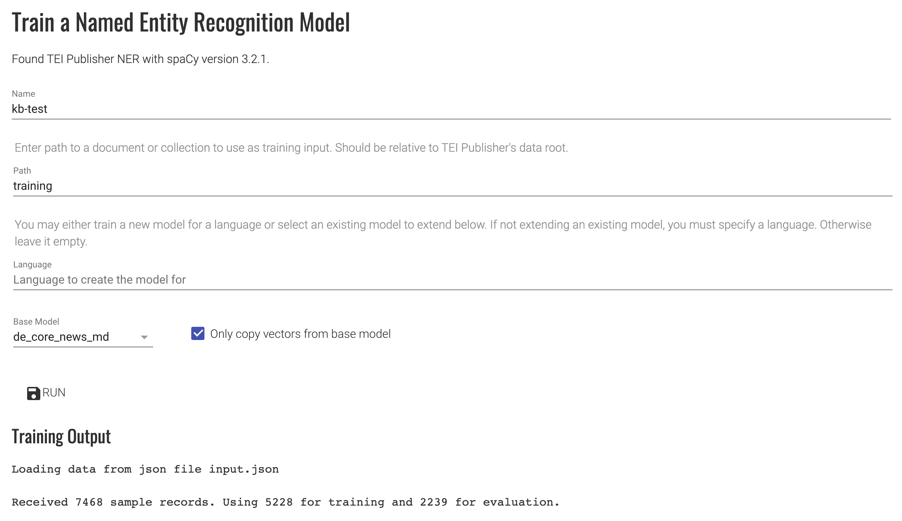
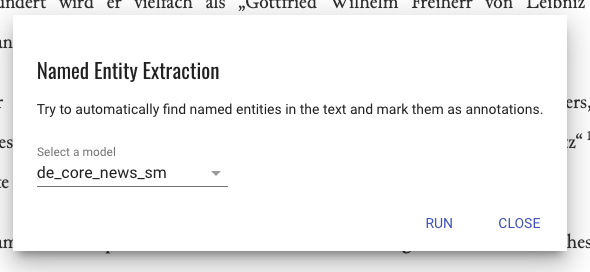

# TEI Publisher Named Entity Recognition API

This repository contains the API used by TEI Publisher's web-annotation editor to detect entities in the input text as well as scripts to train entity recognition models. Named entity recognition is based on [spaCy](https://spacy.io/) and python.

The project

1. serves the **Named Entity Recognition API** which is accessed by TEI Publisher to enrich TEI documents with auto-detected entities
2. provides scripts to **train new models** based on training data extracted from existing TEI documents in TEI Publisher

## Installation

**Note**: as this feature is still under development, you need the `feature/annotations-nlp` branch of TEI Publisher, which integrates the NER API into the web-annotation editor.

1. Install dependencies by running

    `pip3 install -r requirements.txt`

2. Download one or more trained [spaCy pipelines](https://spacy.io/models), e.g. for German:

    `python -m spacy download en_core_web_sm`

## Starting the Named Entity Recognition Service

We're using a [spaCy project setup](https://spacy.io/usage/projects) to orchestrate the different services and workflow steps. The setup is configured in [`project.yml`](project.yml), where you can change various variables. It also defines various commands and workflows. They can be executed using [`python -m spacy project run [name]`](https://spacy.io/api/cli#project-run). Commands are only re-run if their inputs have changed.

To start the Named Entity Recognition (NER) Service, run the following command:

```sh
python -m spacy project run serve
```

By default the service will listen on port 8001, which corresponds to the port TEI Publisher has configured. If you now open a document in TEI Publisher's annotation editor (or reload the browser window if you had one open), you should see that an additional button is enabled at the bottom right of the toolbar. This indicates that TEI Publisher was able to communicate with the NER service.


### How Does it Work?

Whenever a user runs automatic entity detection

1. TEI Publisher extracts the plain text of a TEI document, remembering the original position of each text fragment within the TEI XML
2. The plain text is sent to the `/entities` endpoint of the named entity recognition API, which returns a JSON array of the entities found
3. TEI Publisher re-maps each received entity back to its position in the original TEI XML and creates an annotation, which is inserted into the web annotation editor

### API Documentation

You can view the API documentation here: http://localhost:8001/docs

## Training a Model

The default models provided by spaCy perform well on simple modern language texts, but may not produce adequate results on your particular edition. You may thus want to train a model based on a sample collection of texts you compiled. This requires that you have TEI documents which have already been semantically enriched with entity markup, e.g. by annotating them manually using TEI Publisher's annotation editor.

You can train a new model:

1. using TEI Publisher's web interface
2. via the command line

The **first step** is the same for both approaches: store the compiled sample documents into a collection below TEI Publisher's `data` collection (or reuse the existing `annotate` collection). The easiest way is to use eXide for creating a sub-collection (below `/db/apps/tei-publisher/data`) and uploading the compiled documents.

### Using TEI Publisher's Web Interface

As logged in user, access the `train-ner.html` page in TEI Publisher directly or navigate to it via the `admin` menu.



### Training via the command line

To train a model:

1. make sure that the variable `training_collection` in [`project.yml`](project.yml) points to the sample collection you chose
2. run the `all` workflow to start the training

```sh
python3 -m spacy project run all
```

This will:

1. contact TEI Publisher's API endpoint to extract sample data from the documents in the collection. The sample data is essentially a list of text blocks and the position of entities occurring in those blocks.
2. convert the received sample data into the binary format required by spaCy
3. start the actual training

The result will be a new model stored into the `models` subdirectory. Now restart the NER service and you should see that the new model is picked up by TEI Publisher and offered for selection in the *models* dropdown within the annotation editor.



## List of Commands

The following commands are defined by the project. They
can be executed using [`spacy project run [name]`](https://spacy.io/api/cli#project-run).
Commands are only re-run if their inputs have changed.

| Command | Description |
| --- | --- |
| `clean` | Remove auxiliary files and directories |
| `cleanall` | Remove auxiliary files and directories |
| `download` | Download a spaCy model with pretrained vectors |
| `convert` | Convert the data to spaCy's binary format |
| `check` | Check the created training data sets |
| `create-config` | Create a new config with an NER pipeline component |
| `create-config-update` | Create a config, which updates the NER component of an existing pipeline, but keeps all other components |
| `train` | Train the NER model |
| `train-with-vectors` | Train the NER model with vectors |
| `evaluate` | Evaluate the model and export metrics |
| `package` | Package the trained model as a pip package |
| `visualize-model` | Visualize the model's output interactively using Streamlit |
| `serve` | Run the NER API as a service to be accessed by TEI Publisher |

## Workflows

The following workflows are defined by the project. They
can be executed using [`spacy project run [name]`](https://spacy.io/api/cli#project-run)
and will run the specified commands in order. Commands are only re-run if their
inputs have changed.

| Workflow | Steps |
| --- | --- |
| `all` | `clean` &rarr; `convert` &rarr; `create-config` &rarr; `train` |